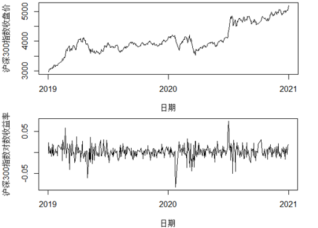
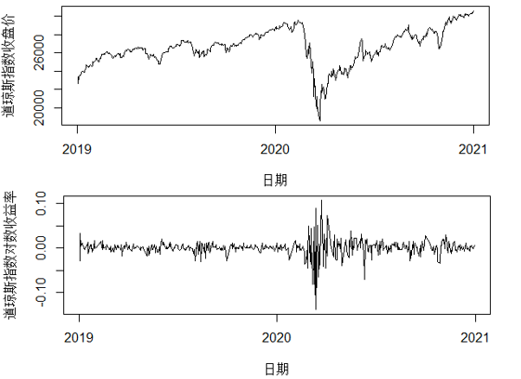
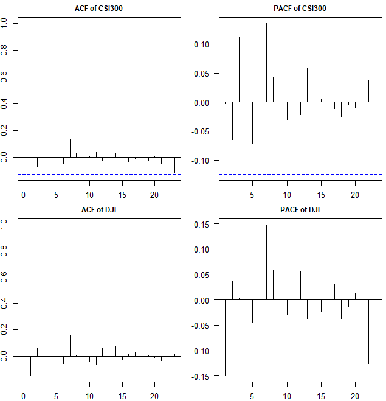
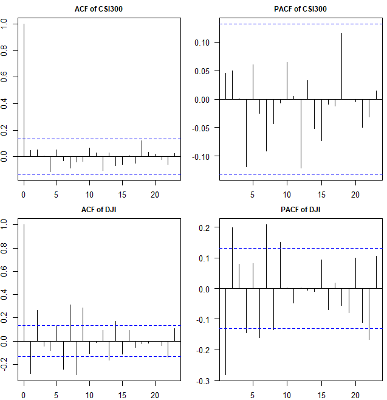
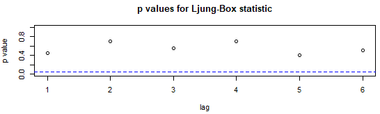
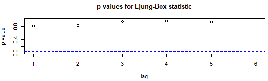
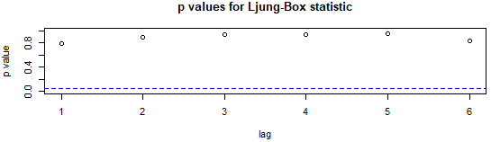
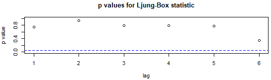
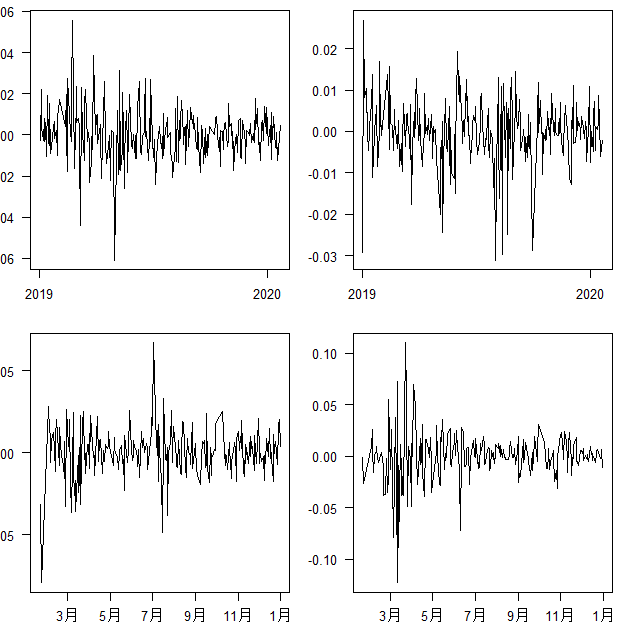

```{r setup, echo=F, purl=F}
knitr::opts_knit$set(root.dir = getwd())
knitr::opts_chunk$set(echo = TRUE, results = 'hide')
knitr::opts_chunk$set(warning = FALSE, message=FALSE)
knitr::opts_chunk$set(fig.align="center"
                      ## ,out.width="0.9\\textwidth" # latex
                      ,out.width="80%" # for both latex and html
                      ,fig.width=5, fig.height=3
                      )
```

```{r prepare, echo=F, purl=F}
rm(list=ls())
options(digits=4)
options(scipen=100)
graphics.off()
Sys.setlocale("LC_ALL", "Chinese")
library(reticulate)
```

# 引言

随着全球化进程的不断加快，各国之间从政治、经济到文化、生态方方面面的联系都愈发紧
密，特别是身处日新月异的21世纪，各国之间的相互影响和信息传递往往更加迅速而及时。
而今，任何一个国家如果遭遇突发性社会事件或公共事件，其他国家都无法独善其身，事件
本身的规模越大，这种影响也越深远。2020年，新冠肺炎疫情在我国爆发，为了打赢这场抗
疫战，全国上下都不得不做出了全面停工停产的巨大牺牲，一时间，国家整体经济情况遭受
重创，这也反映到股票市场上的剧烈波动，而伴随着疫情的有效控制，全国经济回暖，股票
市场因疫情影响产生的波动也逐渐放缓。美国国内疫情爆发晚于我国，但却因为政府的不作
为导致疫情愈演愈烈，尽管美国并未采取任何停摆经济的措施，但其股票市场依旧不可避免
地被殃及。

为了探究新冠肺炎疫情背景下中美两国股票市场的波动情况，本文选取了沪深300指数日收
盘价和道琼斯指数日收盘价来分别反映中国（大陆）和美国股票市场整体行情，并通过差分
得到其对数收益率序列。以疫情爆发的时间点为本文研究的时间分割点，进一步得到疫情前
后中美股指收益率序列，在了解序列数据的基本统计特征和绘制时序图之后，经过一系列检
验，最终拟合GARCH族模型来描绘序列的具体波动特征，并结合实事背景分析疫情对两国股
票市场波动的影响。

# 文献综述

在新冠肺炎疫情爆发期间，国内很多学者针对此次事件的冲击分析了我国经济所遭受的影
响。钟震(2020)研究了疫情对中小银行的影响[@钟震2020]。王伟玲(2020)研究了在疫情防
控中数字经济的发展[@王伟玲2020]。余泳泽和赵成林等人(2020)则针对如何缓解疫情对经
济社会发展的负面冲击展开讨论[@余泳泽2020]。

针对股票市场收益率的波动研究，国内外学者则建立不同的模型来考察外部因素对股市波动
的影响情况。吕鹏勃(2012)基于公司个体维度对股票收益率和波动性的动态关系展开分析[@
吕鹏勃2012]。谢志超和邓翔(2012)采用BEKK模型研究了金融危机前后美国股市、货币市
场、汇市与我国股市之间的波动溢出效应[@谢志超2012]。熊珺(2014)构建GARCH(1,1)以研
究上证A股指数日收益率的波动性影响[@熊珺2014]。林艳丽(2014)和张志芹等人(2012)分别
在股票收益率波动分析中运用了ARCH和EGARCH模型[@林艳丽2014][@张志芹2012]。倪威等
(2017)在对我国体育产业板块股价收益率的波动分析中也建立了GARCH族模型[@倪威2017]。
戴雯(2018)通过构建ARMA-GARCH模型族对ST类股票收益率进行波动分析[@戴雯2018]。
Tai(2006)利用多元MGARCH-M模型研究了在亚洲大部分新兴股市实行市场自由化前后市场的
波动性[@Tai2006]。Alsalman和Zeina使用双变量GARCH-VAR模型来检验油价不确定性在总体
和行业水平上对美国实际股票收益的影响[@Alsalman2016]。

#  基本统计描述

## 数据来源及选取

本文中有关新冠肺炎疫情的数据来源于美国约翰斯·霍普金斯大学系统科学与工程中心
(JHUCSSE)发布的2019年新型冠状病毒可视化仪表盘的数据库。与美国疾控中心和媒体每天
发布一次疫情数据相比，约翰·霍普金斯大学的数据基本实现了实时更新，这得益于人工采
集和自动更新相结合的方式。其中，本文所需要的数据包括中国（大陆）和美国的累计确
诊、累计死亡和累计治愈人数。其他股指数据来源于英为财情网
(https://cn.investing.com/)，该网站提供超十万种金融资产品种的实时行情报价，并且
可以选取相应时间范围直接下载所需数据，十分便捷。

在数据的选取上，本文需要能反映某个股票市场整体行情的数据。对于中国大陆股票市场而
言，沪深两市均有独立的综合指数和成份股指数，但不足以反映整体趋势，而沪深300指数
(CSI300)选择了跨市场的指数样本，且涵盖了大部分流通市值，故能够成为反映两大市场大
局走势的典型代表。在美股市场，作为世界上历史最悠久的股指，道琼斯指数(DJI)占纽约
证券交易所总股票价值的80%以上，且在选股时考虑了市场价值、流动性和行业代表性等因
素。因此，本文选定沪深300指数和道琼斯指数作为反映中国大陆和美国的股票市场行情的
代表。

## 中美股指数据预处理

鉴于新冠肺炎疫情的持续时间长，且需要排除其他突发重大事件的影响，因此样本数据的时
间区间跨度不宜过长。本文选取的中美股指日收盘价数据的时间范围为2019年1月2日至2020
年12月31日，其中2020年1月22日为疫情统计数据的起点，也即分析股指数据变化的分水
岭。考虑到中美股票市场的交易日存在少许差异，故首先需要对数据处理使得交易日同步。
在金融数据的预处理中，为了消除指数的不平稳性，通常对日收盘价数据进行对数差分建立
对数收益率${r_t}$序列，该过程可表示为：

$${r_t} = \ln {R_t} - \ln {R_{t - 1}}$$

其中，${R_t}$为第$t$期收盘价，${R_{t - 1}}$为第$t-1$期收盘价。对数据的预处理完成
后，便可对股指收益率序列展开实证分析。

## 描述性分析

### 疫情发展阶段划分

```{r  echo=F}
library(rio)
library(ggplot2)
library(knitr)
library(tibble)
library(kableExtra)
```

```{r  echo=F}
ch = import('./data/ch_diff.csv')
us = import('./data/us_diff.csv')
```

```{r cov19ch,fig.cap="中国大陆疫情趋势图",fig.pos="H",dev=c("png","cairo_pdf"),dev.args=list(family="Microsoft YaHei UI Light"),out.width="80%",echo=F}
ggplot(ch,aes(日期,人数,color=新增,group=新增)) + geom_line()
```

上图为我国疫情趋势图。新冠肺炎疫情首先于我国爆发，确诊人数从1月下旬开始呈攀升态
势，并在2月中旬达到峰值，随后逐渐下降直至趋于零。治愈人数也在3月初达到峰值，而后
随着确诊人数存量的减少也逐步递减。可以看到，我国疫情在短期内得到有效控制，且未出
现反弹现象。

```{r cov19us, fig.cap="美国疫情趋势图",fig.pos="H",dev=c("png","cairo_pdf"),dev.args=list(family="Microsoft YaHei UI Light"),out.width="80%",echo=F}
ggplot(us,aes(日期,人数,color=新增,group=新增)) + geom_line()
```

上图为美国疫情趋势图。美国的疫情爆发于3月中旬，由于美国政府没有给予足够的重视，
并未采取果断的应对措施，导致确诊人数呈现出一发不可收拾的持续上升态势。即便治愈人
数也呈递增趋势，但远不及其确诊人数的增长速度。当前，美国已成为全世界疫情最严重的
国家，且尚无可控的迹象。

由此，本文将2020年1月22日作为研究的时间分割点，探讨新冠疫情爆发前后中美股市收益
率的波动情况。

### 基本统计特征

首先对经预处理所得的中美股指对数收益率数据的基本统计特征进行简单描述，将疫情爆发
前的沪深300指数和道琼斯指数收益率数据分别标记为LRSCI0、LRDJI0，疫情爆发后的数据
分别标记为LRSCI1、LRDJI1，基本指标如下表所示：

```{r stats, results='markup',fig.pos="H", echo=F}
des = read.csv("./data/des.csv", header=T, check.names = F)
kable(des,row.names = F,align = c("l","c","c","c","c"), caption="基本统计特征描述",
      longtable = T, booktabs = T, linesep="")%>%
      kable_styling(full_width=T)
```

从表中可以看出，尽管在疫情爆发前后两个指数的收益率均值均为正，但都表现出不同程度
的减少，而收益率的标准差明显高于均值，说明收益率序列的波动幅度较大。从偏度和峰度
来看，沪深300指数收益率在疫情前表现为右偏，疫情后变为左偏；两股指收益率峰度均不
等于3，序列表现出尖峰厚尾的分布特征。对比疫情爆发前后的标准差大小，其增长显示出
波动幅度的进一步增大，道琼斯指数的收益率序列在这一点上表现得尤为明显，足以表明新
冠肺炎疫情对两国股票市场产生了不同程度的冲击。

# 时序图及序列检验

## 时序图

分别作沪深300指数和道琼斯指数的日收盘价和对数收益率时间序列图，以便更加直观地观
察数据的波动情况。得到结果如下所示：

```{r tscsi, fig.cap="沪深300指数收盘价与对数收益率时序图",fig.pos="H",dev='png',out.width="90%",results='markup',echo=F}

```

上图为沪深300指数收盘价与对数收益率时序图。可以看到，在2020年开年不久，受到疫情
爆发致全国生产活动被迫停摆的影响，股票市场的收盘价和收益率均出现下行。而随着疫情
得到控制和全国范围内的复工复产，经济逐步复苏，股票市场也开始回暖。

```{r tsdji, fig.cap="道琼斯指数收盘价与对数收益率时序图",fig.pos="H",dev='png',out.width="90%",results='markup',echo=F}

```

上图为道琼斯指数收盘价与对数收益率时序图。美国国内疫情爆发时间晚于我国，道琼斯指
数收盘价在疫情爆发时出现了大幅下滑，收益率也在疫情初期呈现出剧烈震荡的形势，说明
美国股票市场同样遭受了疫情带来的沉重打击。尽管美国疫情尚未得到有效控制，但由于美
国并未采取长时间大范围的停工措施，因而伴随着疫情的持续发展，股票市场的波动也逐渐
趋缓。

## 平稳性检验

在了解了两个股票指数收益率序列的基本特性后，还需要对数据进行平稳性检验。这里采用
的平稳性单位根检验方法为ADF(Augmented Dickey-Fuller)检验，其原理是，对任一AR(p)
过程$x_{t}=\phi_{1} x_{t-1}+\phi_{2} x_{t-2}+\cdots+\phi_{p} x_{t-p}$，若序列平
稳，则$\phi_{1}+\phi_{2}+\cdots+\phi_{p}<1$；若序列非平稳，则至少存在一个单位根
使得$\phi_{1}+\phi_{2}+\cdots+\phi_{p}=1$，因此考察序列的平稳性可以看回归系数之
和是否等于1。分别对疫情爆发前后两个阶段的沪深300指数和道琼斯指数的收益率序列进行
ADF检验，结果见下表：

```{r adf, results='markup',fig.pos="H", echo=F}
adf_pp = import("./data/adf.xlsx")
colnames(adf_pp)=c(" ", 'ADF检验', '结论')
kable(adf_pp,row.names = F,align = c("l","c","c"), caption="检验结果",
      longtable = T, booktabs = T, linesep="")%>%
      kable_styling(full_width=T)
```

检验结果显示，在默认的5%的显著性水平下，四个收益率序列的p值均小于0.05，表明各时
间序列数据均为平稳序列。

## 自相关检验

接下来对收益率序列进行自相关检验，以充分提取序列中蕴藏的信息。同样分别对疫情爆
发前后的沪深300指数和道琼斯指数收益率序列作自相关图和偏自相关图，结果如下：

```{r acfpacf0, fig.cap="疫情前各收益率序列自相关图和偏自相关图",fig.pos="H",dev='png',out.width="90%",results='markup',echo=F}

```

```{r acfpacf1, fig.cap="疫情后各收益率序列自相关图和偏自相关图",fig.pos="H",dev='png',out.width="90%",results='markup',echo=F}

```

可以看到，疫情前后各收益率序列的自相关和偏自相关图均显示不截尾，说明各序列存在较
强的自相关性，故可以进一步对其拟合ARMA(p,q)模型。

## ARMA模型定阶

利用R软件forecast包的auto.arima函数并结合自相关图和偏自相关图对各收益率序列定
阶，使用最小信息量准则即AIC(Akaike information criterion)准则考察模型的优劣，最
终拟合各ARMA模型的最佳阶数如下表所示：

```{r arma, results='markup',fig.pos="H", echo=F}
armas = import("./data/arma.xlsx")
colnames(armas)=c(" ",'LRCSI0','LRDJI0','LRCSI1','LRDJI1')
kable(armas,row.names = F,align = c("l","c","c","c","c"), caption="ARMA模型定阶结果",
      longtable = T, booktabs = T, linesep="")%>%
      kable_styling(full_width=T)
```

由系统给定的模型系数得到各拟合模型，疫情爆发前的沪深300指数和道琼斯指数对数收益
率序列ARMA模型分别为

$$x_{t} = 0.0013-0.8794x_{t-1}+\epsilon_{t}+0.9451\epsilon_{t-1}$$

$$x_{t} = 0.0009-0.1579x_{t-1}+\epsilon_{t}$$

疫情爆发后的沪深300指数和道琼斯指数对数收益率序列ARMA模型分别为

$$x_{t}
=0.0011-0.0100x_{t-1}-0.8561x_{t-2}+\epsilon_{t}+0.0377\epsilon_{t-1}+1.0000\epsilon_{t-2}$$

$$x_{t} = 0.0001+\epsilon_{t}-0.2102\epsilon_{t-1}+0.2815\epsilon_{t-2}$$

## 残差序列白噪声检验

确定了模型的口径后，还需要对模型的显著性进行检验。如果模型是显著的，则表明提取的
序列信息是充分有效的，即拟合的残差序列中将不存在相关信息，因此模型的显著性检验也
即残差序列的白噪声检验。本文使用Ljung-Box统计量来检验各序列残差的纯随机性，并绘
制延迟6阶的p值序列图如下：

```{r pvcsi0, fig.cap="疫情前沪深300指数收益率残差序列p值",fig.pos="H",dev='png',out.width="90%",results='markup',echo=F}

```

```{r pvdji0, fig.cap="疫情前道琼斯指数收益率残差序列p值",fig.pos="H",dev='png',out.width="90%",results='markup',echo=F}

```

上图为疫情爆发前两指数对数收益率残差序列白噪声检验延迟前6阶的p值，图中p值均远大
于显著性水平，不能拒绝残差序列为白噪声的原假设。

```{r pvcsi1, fig.cap="疫情后沪深300指数收益率残差序列p值",fig.pos="H",dev='png',out.width="90%",results='markup',echo=F}

```

```{r pvdji1, fig.cap="疫情后道琼斯指数收益率残差序列p值",fig.pos="H",dev='png',out.width="90%",results='markup',echo=F}

```

上图为疫情爆发后两指数对数收益率残差序列白噪声检验延迟前6阶的p值，同样，p值大于
给定的默认显著性水平，残差序列均为白噪声。以上检验结果表明各ARMA模型拟合效果良
好。

## ARCH效应检验

作上述各残差序列的时序图如下，不难看出，残差序列多数时候是平稳的，但在某些时段，
波动会持续性偏大，表现出一定的集群效应。习惯上通常用方差来描述一个序列的波动性，
而残差的集群效应显示出其方差可能是非齐性的，为此，需要对各残差序列进行ARCH效应检
验，判断其是否存在异方差性。

```{r res, fig.cap="各收益率残差时序图",fig.pos="H",dev='png',out.width="90%",results='markup',echo=F}

```

常用的ARCH检验统计方法一般有两种，分别为Portmanteau Q检验和格朗日乘子检验（简记
为LM检验），此处选用LM检验。LM检验的基本思想是：如果残差序列具有集群效应，且方差
是非齐的，那么残差平方序列通常自相关。

```{r archtest, results='markup',fig.pos="H", echo=F}
arch_test = import("./data/arch_test.xlsx")
colnames(arch_test)=c(" ",'LRCSI0','LRDJI0','LRCSI1','LRDJI1')
kable(arch_test,row.names = F,align = c("l","c","c","c","c"), caption="ARCH效应检验",
      longtable = T, booktabs = T, linesep="")%>%
      kable_styling(full_width=T)
```

上表为各残差序列ARCH效应检验统计量及p值大小，所有p值均小于0.1的显著性水平，表明
序列方差显著非齐，且残差平方序列显著自相关，故可以进一步拟合GARCH族模型来阐释残
差序列的波动性。

# GARCH族模型的构建

对于存在波动聚集效应的金融时间序列数据来说，可以拟合GARCH族模型来刻画其波动特
征。在拟合GARCH族模型之前，还需要先对数据进行一系列的检验。例如本文使用的沪深300
指数和道琼斯指数差分对数收益率序列，根据研究背景划分新冠肺炎疫情爆发的时间阶段，
分别得到疫情爆发前后的两个指数的收益率序列，首先对序列进行平稳性检验，结果是各序
列均平稳；其次，对序列做自相关检验，发现序列表现出较强的自相关性，并由此建立ARMA
模型；再次，通过检验模型的残差是否为白噪声来判断模型是否显著，结果显示，各残差序
列为白噪声，拟合的各ARMA模型均是显著的；最后，由残差的时序图猜测序列存在异方差
性，并进行ARCH检验，检验结果表明各残差序列方差显著非齐，故而具备了进一步拟合
GARCH族模型的所有条件。鉴于GARCH族模型的选择性较多，本文选取了常用的适用于收益率
序列的模型来进行构建，并找到其中的最佳模型。

## 基于GARCH(1,1)模型的收益率波动影响分析

前文分析表明股指收益率序列为尖峰厚尾序列，考虑到GARCH模型的拟合阶数不宜过高，且
GARCH(1,1)对金融时间序列数据的解释性较好，故此处使用最简单的GARCH(1,1)模型来描述
疫情前后股指收益率序列的波动情况。GARCH(1,1)的结构如下：

$$\left\{\begin{array}{l}
r_{t}=\alpha_{0}+a_{t}, a_{t}=\sigma_{t}\epsilon_{t}, \epsilon_{t} i.i.d. N(0,1) \\
\sigma^2_{t}=\beta_{0}+\beta_{1}a^2_{t-1}+\beta_{2}\sigma^2_{t-1}
\end{array}\right.$$

使用R软件fGarch包的garchFit函数拟合GARCH(1,1)模型，其中可设置三种不同的条件分
布，分别为正态条件分布、条件t分布和有偏t分布，在三种不同条件下对疫情爆发前后的沪
深300指数和道琼斯指数对数收益率序列建模，统一采用常数均值作为均值模型，
GARCH(1,1)作为波动率模型。除了前文提到的AIC准则，此处还引入贝叶斯信息准则即
BIC(Bayesian Information Criterion)准则来帮助选择最佳模型。不同条件分布下各拟合
模型的AIC和BIC的值见下表：

```{r garch, results='markup',fig.pos="H", echo=F}
garch = import("./data/garch.xlsx")
colnames(garch)=c(" "," ",'LRCSI0','LRDJI0','LRCSI1','LRDJI1')
kable(garch,row.names = F,align = c("l","l","c","c","c","c"), caption="三种条件分布下GARCH模型的AIC和BIC",
      longtable = T, booktabs = T, linesep="")%>%
      kable_styling(full_width=T)
```

对疫情前沪深300指数对数收益率序列建模，根据AIC和BIC准则，都选择了条件t分布
GARCH(1,1)模型，模型为：

$$\left\{\begin{array}{l}
r_{t}=0.00098623+a_{t}, a_{t}=\sigma_{t}\epsilon_{t}, \epsilon_{t} i.i.d. t^*_(5.35) \\
\sigma^2_{t}=0.00000127+0.02968402a^2_{t-1}+0.95759368\sigma^2_{t-1}
\end{array}\right.$$

对疫情前道琼斯指数对数收益率序列建模，根据AIC准则，选择有偏t分布GARCH(1,1)模型；
根据BIC准则，选择条件t分布GARCH(1,1)模型。AIC准则确立的模型为：

$$\left\{\begin{array}{l}
r_{t}=0.000793+a_{t}, a_{t}=\sigma_{t}\epsilon_{t}, \epsilon_{t} i.i.d. t^*_(0.87,3.89) \\
\sigma^2_{t}=0.0000045736+0.10719a^2_{t-1}+0.82356\sigma^2_{t-1}
\end{array}\right.$$

对疫情后沪深300指数对数收益率序列建模，根据AIC和BIC准则，都选择了条件t分布
GARCH(1,1)模型，模型为：

$$\left\{\begin{array}{l}
r_{t}=0.0014522+a_{t}, a_{t}=\sigma_{t}\epsilon_{t}, \epsilon_{t} i.i.d. t^*_(4.5) \\
\sigma^2_{t}=0.000012502+0.064975a^2_{t-1}+0.86923\sigma^2_{t-1}
\end{array}\right.$$

对疫情后道琼斯指数对数收益率序列建模，根据AIC准则，选择有偏t分布GARCH(1,1)模型；
根据BIC准则，选择条件t分布GARCH(1,1)模型。AIC准则确立的模型为：

$$\left\{\begin{array}{l}
r_{t}=0.00078142+a_{t}, a_{t}=\sigma_{t}\epsilon_{t}, \epsilon_{t} i.i.d. t^*_(0.83,6.29) \\
\sigma^2_{t}=0.0000076559+0.25757a^2_{t-1}+0.72999\sigma^2_{t-1}
\end{array}\right.$$

上述构建的GARCH(1,1)模型中，系数$\beta_{1}+\beta_{2}$的值均小于1，可知各个收益率
序列都满足平稳的条件，另一方面也说明新冠肺炎疫情对中美两国股市波动的影响在时间长
度上是有限的。同时，对比疫情后两国股指收益率序列GARCH(1,1)模型的
$\beta_{1}+\beta_{2}$的值，道琼斯指数收益率的模型中$\beta_{1}+\beta_{2}$的值更
大，显示出美国股票市场对新冠肺炎疫情的冲击的记忆期更长，即疫情对美国股市影响的减
弱过程更加缓慢。

## 基于EGARCH(1,1)模型的收益率波动非对称性分析

由Nelson于1991年提出的指数GARCH(EGARCH)模型没有GARCH模型参数的非负约束，能够
处理非对称扰动。为检验正、负向扰动对两国股指收益率序列的波动影响，构建
EGARCH(1,1)模型，其结构为：

$$\left\{\begin{array}{l}
r_{t}=\phi_{0}+a_{t}, a_{t}=\sigma_{t}\epsilon_{t}, \epsilon_{t} i.i.d. N(0,1) \\
\ln\sigma^2_{t}=\alpha_{0}+\alpha_{1}(\left|\epsilon_{t-1}\right|+\gamma_{1}\epsilon_{t-1})+\beta_{1}\ln\sigma^2_{t-1}
\end{array}\right.$$

对疫情前后沪深300指数和道琼斯指数对数收益率序列建立EGARCH(1,1)模型，模型系数如下
表所示：

```{r egarch, results='markup',fig.pos="H", echo=F}
egarch = import("./data/egarch.xlsx")
colnames(egarch)=c(" ",'LRCSI0','LRDJI0','LRCSI1','LRDJI1')
kable(egarch,row.names = F,align = c("l","c","c","c","c"), caption="EGARCH(1,1)模型系数",
      longtable = T, booktabs = T, linesep="")%>%
      kable_styling(full_width=T)
```

观察疫情前后两股指收益率序列构建的EGARCH(1,1)模型系数，道琼斯指数收益率的模型中
$\beta_{1}$的值较沪深300指数收益率的模型中的略小，说明整体上美国股票市场受非对称
信息的影响较小，杠杆效应也较小。

# 总结

本文以2020年波及全球的新冠肺炎疫情为研究背景，选取了沪深300指数数据和道琼斯指数
数据来分别反映中美两国股票市场的整体走势，以探究疫情爆发前后两国股市收益率的波动
情况。通过绘制并观察两个股票指数经差分得到的对数收益率时序图，可以明显地看出疫情
的爆发对股票市场产生了强烈的冲击，使得收益率序列出现大幅震荡。在大致了解了数据的
基本统计分布特征后，又对疫情前后各收益率序列进行了平稳性检验、自相关检验和ARMA模
型定阶拟合、序列残差白噪声检验和ARCH效应检验，并最终确定各收益率序列具备构建
GARCH族模型的条件，从而进一步拟合GARCH族模型来描述收益率受疫情影响的波动情况。

在构建GARCH族模型时，本文首先选择建立GARCH(1,1)模型，并结合AIC和BIC准则找到不同
条件分布下的最佳模型，通过模型来刻画各股指收益率受外部冲击即疫情影响的波动情况，
得出的结论是股票市场受疫情的影响在时间测度上有限，且疫情对美国股市的影响较中国更
加持久，其收益率的波动趋缓过程更长。而后还选择构建EGARCH(1,1)模型，以描绘正、负
向的非对称冲击对各股指收益率序列波动的影响，最后得到美国股票市场整体受非对称信息
的影响而产生的波动更小这一结论，也从侧面反映出美国股市的发展更为成熟。

# 参考文献
[//]: # (\bibliography{Bibfile})